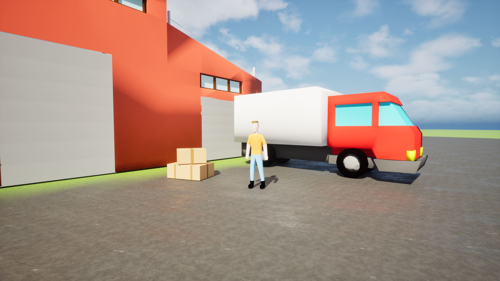

# 📦 Delivery Simulator

> A first-person delivery game built in Unreal Engine 5.
> Pick up packages, load them into your van, and deliver them
> across the neighbourhood before the day ends.



---

## 📖 About

Delivery Simulator is a first-person experience focused on the mundane
satisfaction of a courier's routine. Start your shift at the warehouse,
accept orders on your in-game tablet, load packages into the van and
drive to the destination — all within a single working day.

The project served as a deep dive into vehicle systems and physics-based
object interaction in Unreal Engine 5. The package and vehicle systems
were the main technical focus of development.

> ⚠️ This is a prototype. The core loop is functional but the game
> is not feature-complete.

---

## 🎮 Gameplay Features

- **First-person on foot / third-person in vehicle** — seamless perspective
  switch when entering the van
- **In-game tablet** — accept new delivery orders directly in the world,
  no UI menus
- **Package system** — physically pick up packages at the warehouse,
  load them into the van, carry and hand them off at the destination
- **Day/Night cycle** — deliveries happen within a single in-game day;
  a clock tracks the time
- **End-of-day summary** — total packages delivered counted at day's end
- **Warehouse zone** — new orders can only be started within the warehouse
  boundary, grounding the loop in space

---

## 🔧 Technical Highlights

- Custom vehicle system with perspective switching (FPP on foot / TPP
  in vehicle)
- Physics-based package interaction — pickup, carry and placement
- In-world tablet UI built with Unreal's Widget Component
- Day/Night cycle with time tracking and end-of-day scoring

---

## 🕹️ Download

[](https://jkaczor6.itch.io/delivery-simulator)

> Windows build. No installation required — unzip and run
> `DeliverySimulator.exe`.

---

## 🛠️ Built With


- **Engine:** Unreal Engine 5
- **Language:** C++
- **Platform:** Windows

---

## 🚀 Running from Source

**Requirements:**
- Unreal Engine 5.x
- Visual Studio 2022 with C++ game development workload

**Steps:**
```bash
git clone https://github.com/jkaczor6/DeliverySimulator.git
```
1. Open `DeliverySimulator.uproject` in Unreal Engine
2. When prompted, rebuild missing modules — confirm
3. Press Play in the editor

---

## 📸 Screenshots

| | |
|---|---|
|  |  |
|  |  |

---

## 👤 Author

**Jakub Kaczor** — [Portfolio](https://jkaczor6.github.io/portfolio) ·
[GitHub](https://github.com/jkaczor6)
