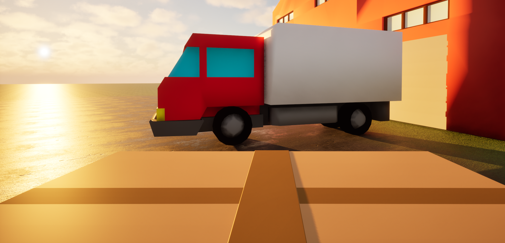
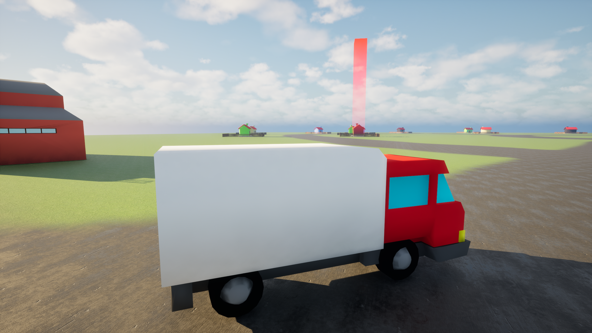
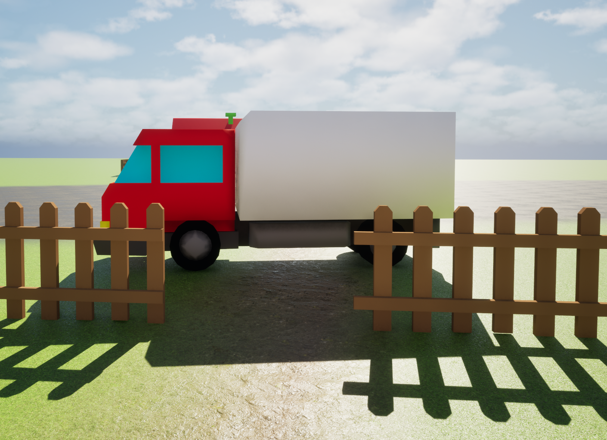
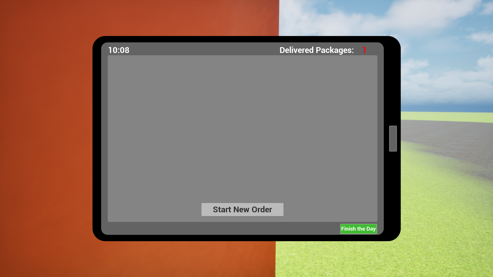

# Delivery Simulator 📦

A first-person delivery game built in Unreal Engine 5. Pick up packages, load them into your van, and deliver them across the neighbourhood before the day ends.

> ⚠️ This is a prototype. The core loop is functional but the game is not feature-complete.

---

## 🎮 Gameplay

Delivery Simulator is a first-person experience focused on the mundane satisfaction of a courier's routine. Start your shift at the warehouse, accept orders on your in-game tablet, load packages into the van and drive to the destination — all within a single working day.

---

## 🧩 Features

| Feature | Description |
|---------|-------------|
| **First-person / third-person** | Seamless perspective switch when entering the van |
| **In-game tablet** | Accept new delivery orders directly in the world, no UI menus |
| **Package system** | Physically pick up packages at the warehouse, load them into the van, carry and hand them off at the destination |
| **Day/Night cycle** | Deliveries happen within a single in-game day; a clock tracks the time |
| **End-of-day summary** | Total packages delivered counted at day's end |
| **Warehouse zone** | New orders can only be started within the warehouse boundary, grounding the loop in space |

---

## 🔧 Technical Highlights

| System | Details |
|--------|---------|
| **Vehicle system** | Custom implementation with seamless FPP on foot / TPP in vehicle perspective switching |
| **Package interaction** | Physics-based pickup, carry and placement |
| **Tablet UI** | In-world UI built with Unreal's Widget Component |
| **Day cycle** | Time tracking with end-of-day scoring |

---

## 🕹️ Play

The game is available on itch.io: [jkaczor6.itch.io/delivery-simulator](https://jkaczor6.itch.io/delivery-simulator)

> Windows build. No installation required — unzip and run `DeliverySimulator.exe`.

---

## 🛠️ Tech Stack

- **Engine:** Unreal Engine 5
- **Language:** C++
- **Platform:** Windows

---

## 🚀 Getting Started

### Prerequisites
- Unreal Engine 5.x
- Visual Studio 2022 (with C++ game development workload)

### Setup
```bash
git clone https://github.com/jkaczor6/DeliverySimulator.git
```
1. Open `DeliverySimulator.uproject` in Unreal Engine
2. When prompted, rebuild missing modules — confirm
3. Press Play in the editor

---

## 📸 Screenshots

| | |
|---|---|
|  |  |
|  |  |

---

## 👤 Author

**Jakub Kaczor** — [Portfolio](https://jkaczor6.github.io/portfolio) · [GitHub](https://github.com/jkaczor6)
